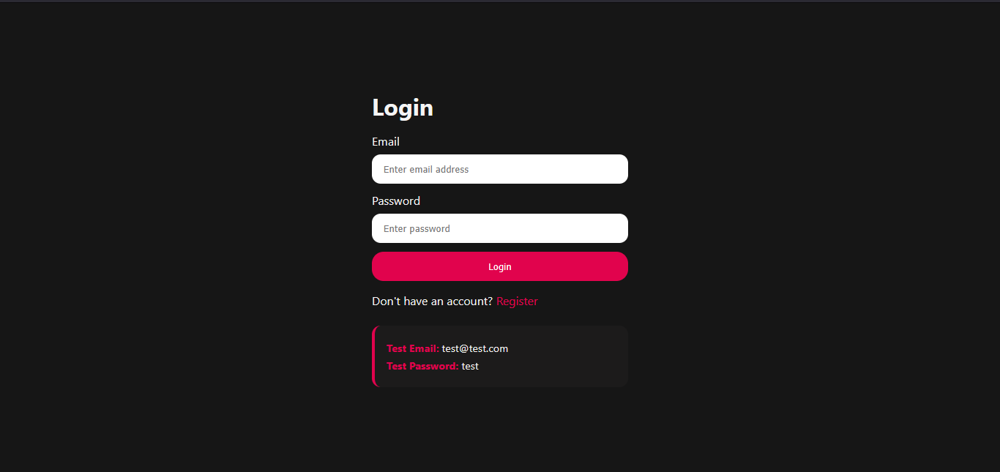
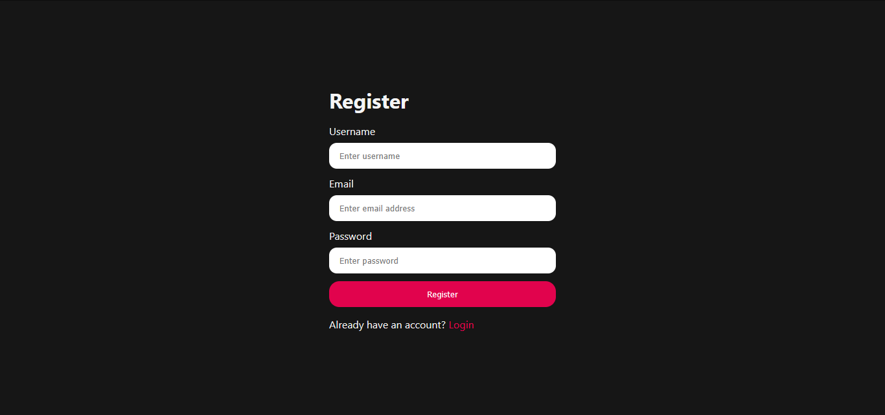
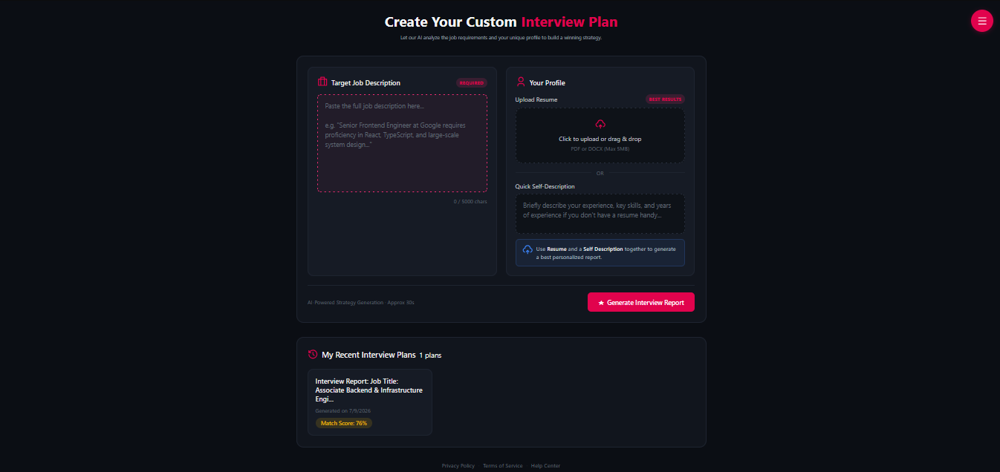
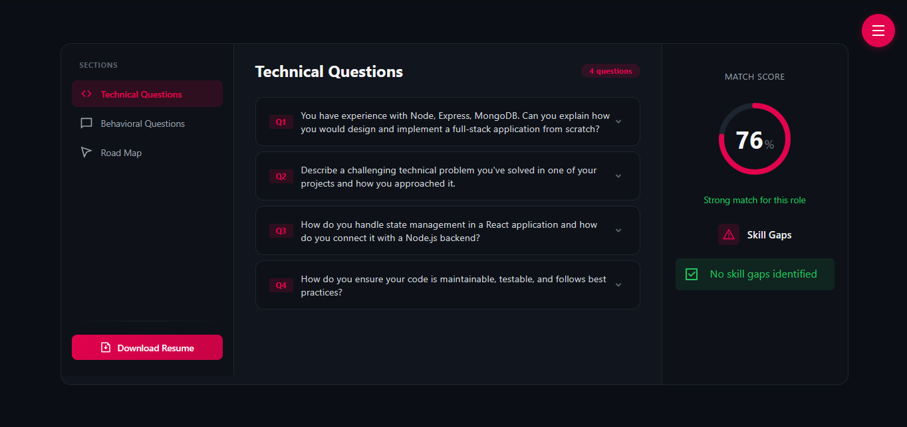
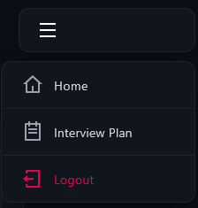
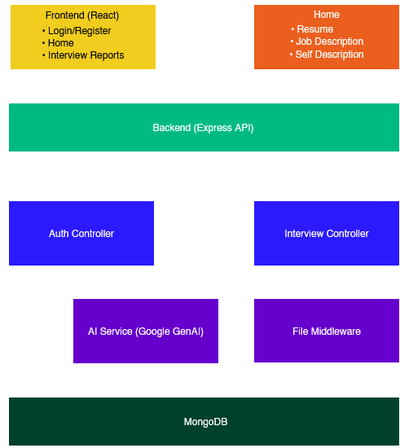

<div align="center">

# SkillLink

### AI-Powered Interview Preparation Platform

A full-stack web application that helps users prepare for interviews using AI-powered resume analysis, job matching, interview questions, and personalized preparation plans.

<br>https://github.com/HiteshXG/SkillLink/edit/main/README.md

[](https://skill-link-brown.vercel.app/)
[](#license)
[]()
[]()

</div>

---

<details>
<summary><b>📑 Table of Contents</b></summary>

- [Live Demo](#live-demo)
- [Features](#features)
- [Screenshots](#screenshots)
- [Tech Stack](#tech-stack)
- [System Architecture](#system-architecture)
- [Folder Structure](#folder-structure)
- [Installation](#installation)
- [Environment Variables](#environment-variables)
- [Running the Project](#running-the-project)
- [API Endpoints](#api-endpoints)
- [Future Improvements](#future-improvements)
- [Author](#author)
- [License](#license)

</details>

# Live Demo

🔗 https://skill-link-brown.vercel.app/

---

# Features

| Feature | Description |
|----------|-------------|
| Authentication | Secure JWT Authentication |
| Resume Upload | Upload Resume in PDF |
| AI Resume Analysis | Analyze Resume with Google Gemini |
| Resume Match Score | Compare Resume against Job Description |
| Skill Gap Detection | Identify Missing Skills |
| Technical Questions | AI Generated Technical Interview Questions |
| Behavioral Questions | Personalized HR Questions |
| Learning Roadmap | Step-by-step Preparation Plan |
| AI Resume Generator | Generate ATS Friendly Resume |
| Interview History | Access Previous Reports |

---

# Screenshots

### Authentication

<p align="center">
   <h1 align="center">Login</h1>
   
   <h1 align="center">Register</h1>
   
</p>

---

### Application

<p align="center">
   <h1 align="center">Home</h1>
   
   <h1 align="center">Interview Reports</h1>
   
</p>

---

### Navigation

<p align="center">
   <h1 align="center">Menu</h1>
   
</p>


# Tech Stack

### Frontend


---

### Backend


---

### AI


---

# System Architecture

<p align="center">

</p>

### Workflow

1. User registers or logs in.
2. JWT authenticates every protected request.
3. User uploads Resume, Job Description and Self Description.
4. Backend extracts text from Resume.
5. Google Gemini analyzes all inputs.
6. AI generates:
   - Resume Match Score
   - Skill Gap Analysis
   - Technical Questions
   - Behavioral Questions
   - Learning Roadmap
7. Report is stored in MongoDB.
8. User can revisit reports or generate an AI-powered resume.

---

# Folder Structure

<details>

<summary>Click to Expand</summary>

```text
SkillLink
│
├── Backend
│   ├── src
│   │   ├── config
│   │   ├── controllers
│   │   ├── middlewares
│   │   ├── models
│   │   ├── routes
│   │   └── services
│   ├── server.js
│   └── package.json
│
├── Frontend
│   ├── src
│   │   ├── components
│   │   ├── features
│   │   ├── App.jsx
│   │   └── main.jsx
│   ├── api.config.js
│   └── package.json
│
├── assets
└── README.md
```

</details>

---

# Installation

## Clone Repository

```bash
git clone https://github.com/HiteshXG/SkillLink.git
```

---

## Backend

```bash
cd Backend

npm install

npm run dev
```

---

## Frontend

```bash
cd Frontend

npm install

npm run dev
```

---

# Environment Variables

## Backend

Create a `.env` file inside the Backend directory.

```env
PORT=

MONGO_URI=

JWT_SECRET=

GOOGLE_GENAI_API_KEY=

FRONTEND_URL=
```

---

## Frontend

Create a `.env` file inside the Frontend directory.

```env
VITE_API_BASE_URL=
```

---

# Running the Project

## Backend

```bash
cd Backend

npm run dev
```

Backend runs on

```
http://localhost:3000
```

---

## Frontend

```bash
cd Frontend

npm run dev
```

Frontend runs on

```
http://localhost:5173
```

---

# API Endpoints

## Authentication

```http
POST /api/auth/register
```

Create a new account.

---

```http
POST /api/auth/login
```

Authenticate a user.

---

```http
GET /api/auth/logout
```

Logout the current user.

---

```http
GET /api/auth/get-me
```

Fetch logged-in user's profile.

---

## Interview

```http
POST /api/interview/
```

Generate Interview Report.

---

```http
GET /api/interview/
```

Fetch all reports.

---

```http
GET /api/interview/report/:id
```

Fetch report by ID.

---

```http
POST /api/interview/resume/pdf/:id
```

Generate AI Resume PDF.

---

# Future Improvements

- Voice Mock Interviews
- Company Specific Interview Preparation
- ATS Resume Score
- AI Career Assistant
- Dark Mode
- Dashboard Analytics
- Interview Scheduler

---

# Author

## Hitesh Gavand

[](https://github.com/HiteshXG)

[](https://linkedin.com/in/hitesh-gavand)

[](https://x.com/hnxvrtxx)

---

# License

This project is intended for **educational and portfolio purposes**.

If you found this project helpful, consider giving it a ⭐ on GitHub!
